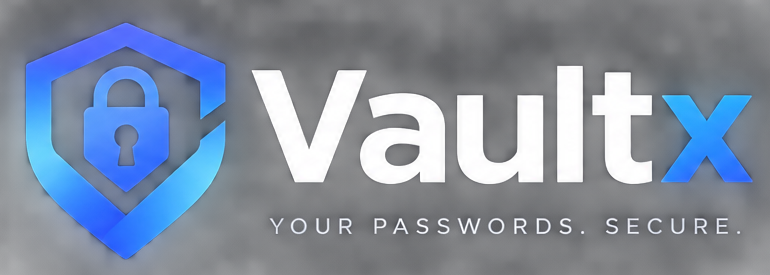

### Your passwords. Your device. Your vault.

A local-first password manager for the web and desktop.

---

## What is VaultX?

VaultX is a **local-first** password manager. Your vault is encrypted in your browser using the Web Crypto API before it ever touches disk, and it never leaves your device.

There is no backend. No accounts. No sync servers. No telemetry. The master password you type never leaves the process you typed it in.

The same codebase runs as:

- A **web app** (any modern browser)
- A **desktop app** (Windows `.exe` via Electron)

Both share identical cryptography, storage, and UI — the desktop build is a hardened Electron shell around the same web bundle.

---

## Features

| | |
|---|---|
| 🔐 **Master-password vault** | One password to unlock everything. Never stored, never transmitted. |
| 🔒 **AES-GCM authenticated encryption** | Confidentiality *and* tamper detection. Fresh IV per operation. |
| 🧮 **PBKDF2-SHA256 key derivation** | 250,000 iterations, per-vault random salt. |
| 💾 **Local IndexedDB storage** | Only the encrypted envelope is persisted. Nothing else. |
| 🎲 **Cryptographically secure password generator** | `crypto.getRandomValues()` with rejection sampling — no modulo bias. |
| 🔎 **Instant search** | Filters over title, website, username, and category in memory. |
| 📁 **Categories** | Personal, Work, School, Finance, Development, Social, Other. |
| ⭐ **Favorites** | One-click pinning with a dedicated quick filter. |
| 🛡️ **Security dashboard** | Detects weak, reused, and stale passwords — entirely offline. |
| 📋 **Secure clipboard** | Copy buttons with best-effort 30-second auto-clear. |
| ⏱️ **Auto-lock** | Configurable inactivity timeout, default 5 minutes. Clears key and plaintext from memory. |
| 📦 **Encrypted export / import** | Portable `.vaultx` backups. Encrypted envelope only — never plaintext. |
| 🖥️ **Desktop build** | Native Windows app packaged with Electron and `electron-builder`. |
| ♿ **Accessible UI** | Keyboard navigation, visible focus states, ARIA labels, sufficient contrast. |
| 📱 **Responsive** | Desktop, laptop, tablet, mobile. |

---

## Architecture
